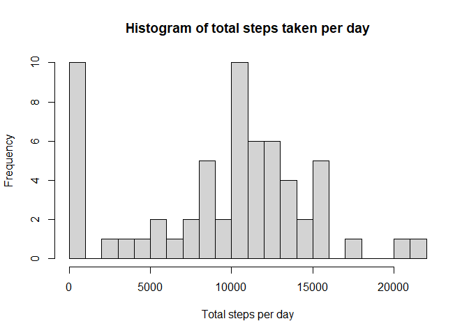
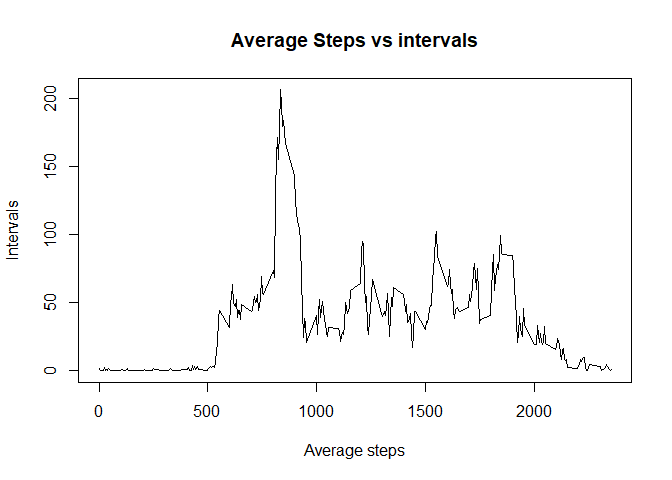
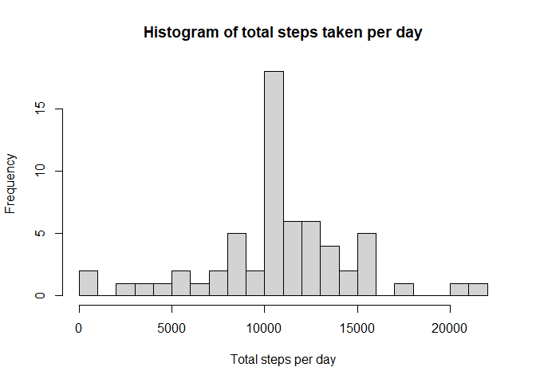
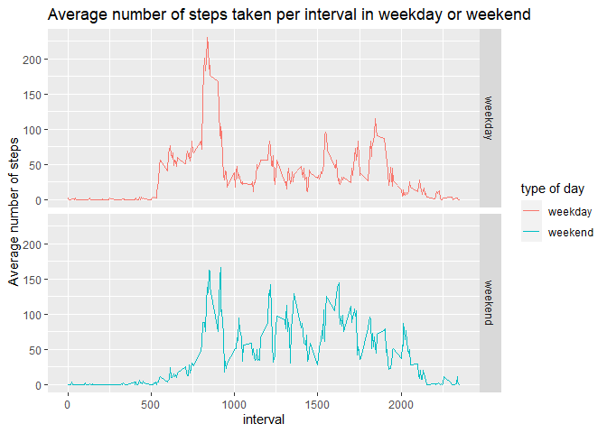

For this assignment, we are required to answer a set of question using R Markdown.
The full list of instructions are written in this [link](https://github.com/Crumbofthypuss/RepData_PeerAssessment1/blob/master/README.md).

We set all R codes to be visible. We also call out the libraries to be used.


## Loading and preprocessing the data
First, download the data that can be found in the link.
Assuming that the file is downloaded and unzipped already, read the file.

```r
activity <- read.csv("activity.csv")
head(activity)
```

```
##   steps       date interval
## 1    NA 2012-10-01        0
## 2    NA 2012-10-01        5
## 3    NA 2012-10-01       10
## 4    NA 2012-10-01       15
## 5    NA 2012-10-01       20
## 6    NA 2012-10-01       25
```

## What is mean total number of steps taken per day?
First, compute for the total number of steps taken per day then make histogram

```r
totalsteps<- activity %>% group_by(date) %>% summarise(total=sum(steps,na.rm=TRUE))
```

```
## `summarise()` ungrouping output (override with `.groups` argument)
```

```r
hist(totalsteps$total,xlab="Total steps per day",main="Histogram of total steps taken per day",breaks=20)
```

<!-- -->

Computing for the mean and median of the sum of steps per day

```r
meandays<-mean(totalsteps$total)
mediandays<-median(totalsteps$total)
```
The mean of steps taken per day is **9354.2295082** and the median is **10395**.

## What is the average daily activity pattern?
First step is to compute for the average number of steps for all days depending on interval
then plot the average and the interval

```r
averagesteps<- activity %>% group_by(interval) %>% summarise(average=mean(steps,na.rm=TRUE))
```

```
## `summarise()` ungrouping output (override with `.groups` argument)
```

```r
with(averagesteps,plot(x=interval,y=average,type="l",xlab="Average steps",ylab="Intervals",main="Average Steps vs intervals"))
```

<!-- -->

Determining which interval has the maximum number of steps on average

```r
maxinterval<-averagesteps[which.max(averagesteps$average),]$interval
```
The interval containing the highest averaged steps is **835**.

## Imputing missing values
Computing for the total amount of missing values in the dataset

```r
sum(is.na(activity$steps))
```

```
## [1] 2304
```

This time, we will replace missing values with the mean from each corresponding interval

```r
newActivity<- activity %>% group_by(interval) %>% mutate(steps=replace(steps,is.na(steps),mean(steps,na.rm=TRUE)))
head(newActivity)
```

```
## # A tibble: 6 x 3
## # Groups:   interval [6]
##    steps date       interval
##    <dbl> <chr>         <int>
## 1 1.72   2012-10-01        0
## 2 0.340  2012-10-01        5
## 3 0.132  2012-10-01       10
## 4 0.151  2012-10-01       15
## 5 0.0755 2012-10-01       20
## 6 2.09   2012-10-01       25
```

A new dataset newActivity has been created. Making a histogram from it

```r
newtotalsteps<- newActivity %>% group_by(date) %>% summarise(total=sum(steps,na.rm=TRUE))
```

```
## `summarise()` ungrouping output (override with `.groups` argument)
```

```r
hist(newtotalsteps$total,xlab="Total steps per day",main="Histogram of total steps taken per day",breaks=20)
```

<!-- -->

Getting the new mean and total and determining the change

```r
newmeandays<-mean(newtotalsteps$total)
newmediandays<-median(newtotalsteps$total)
meandiff<- newmeandays - meandays
mediandiff<- newmediandays - mediandays
```
The difference in mean is **1411.959171** and **371.1886792** in median.

## Are there differences in activity patterns between weekdays and weekends?
First, create a vector containing the factor for weekdays and weekends

```r
newActivity$weeklabel<- ifelse(weekdays(as.Date(activity$date)) %in% c("Saturday","Sunday"),"weekend","weekday")
```

Making the panel plot of the time series plot and average number of steps using ggplot

```r
newaveragesteps<- newActivity %>% group_by(interval,weeklabel) %>% summarise(average=mean(steps,na.rm=TRUE))
```

```
## `summarise()` regrouping output by 'interval' (override with `.groups` argument)
```

```r
ggplot(newaveragesteps,aes(x=interval,y=average,color=weeklabel)) + geom_line() + facet_grid(weeklabel~.) + labs(y="Average number of steps",x="interval",title="Average number of steps taken per interval in weekday or weekend",col="type of day")
```

<!-- -->
